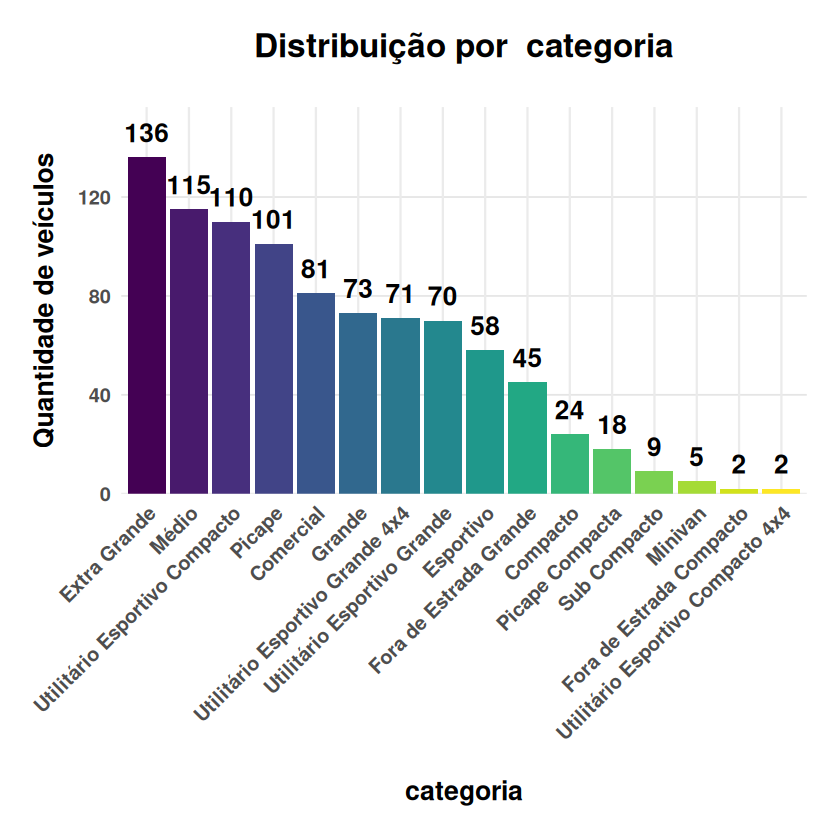
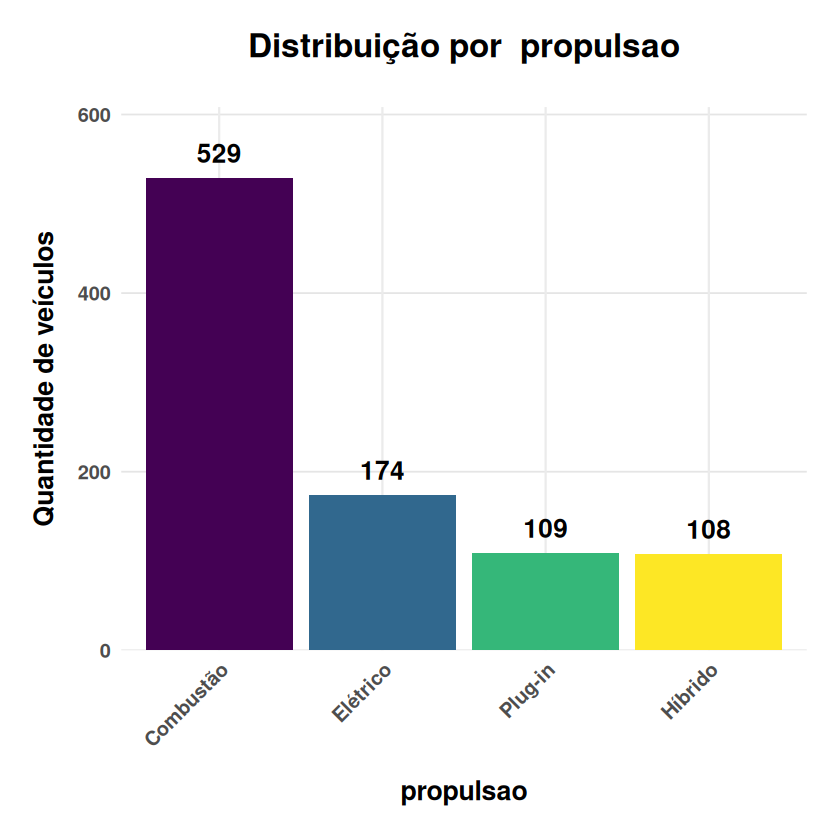
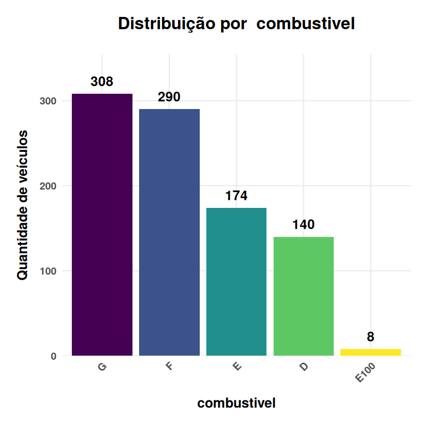
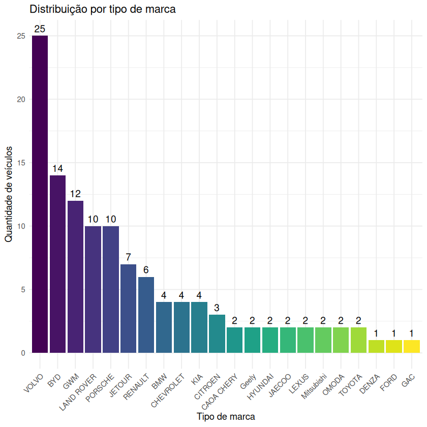
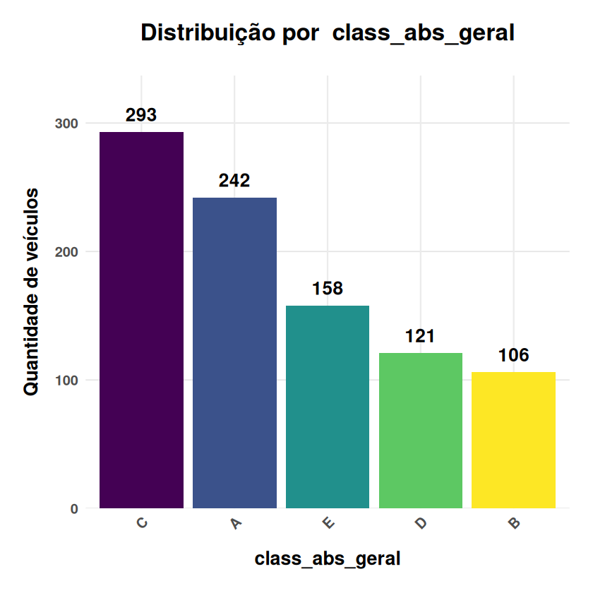
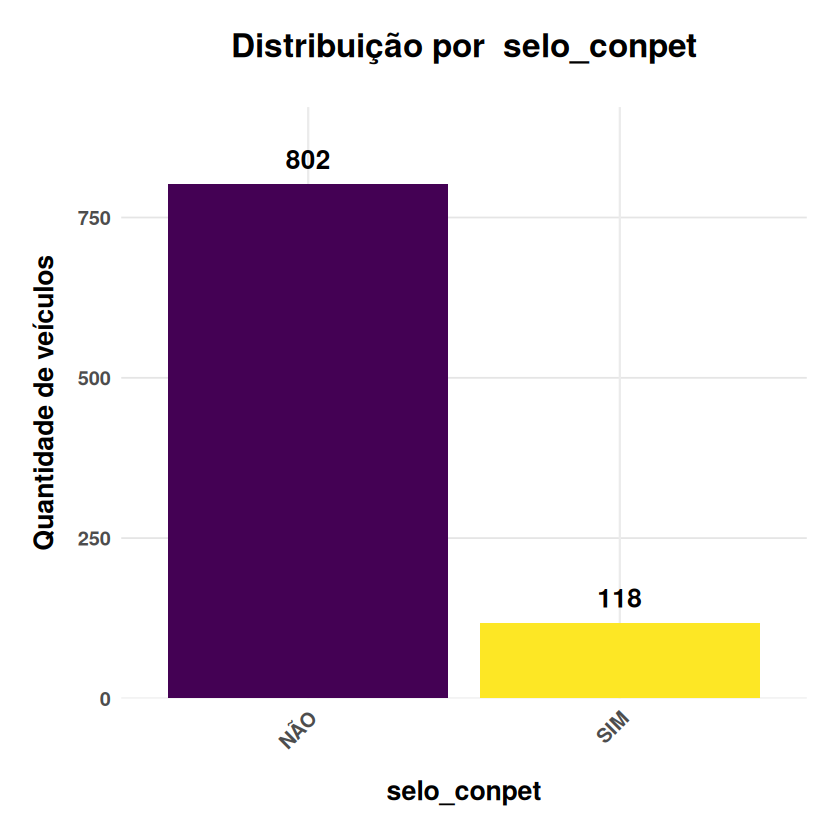
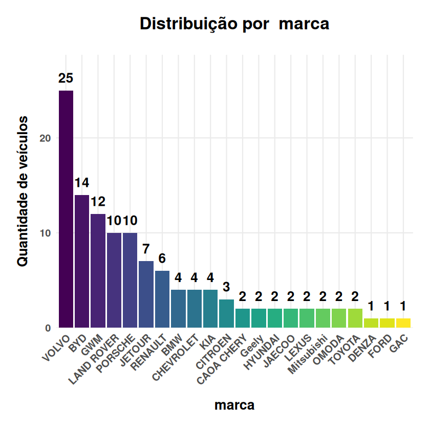

# Análise do Programa brasileiro de etiquetagem (PBE)

### Introdução

Talvez por causa da adesão voluntária, o arquivo carregado no portal [Dados Abertos](https://dados.gov.br/dados/conjuntos-dados/programa-brasileiro-de-etiquetagem-pbe) esteja desatualizado.

No entanto, os dados de veículos leves do **PBEV** (*Programa Brasileiro de Etiquetagem Veicular*), disponíveis em PDF no site do **Inmetro**: https://www.gov.br/inmetro/pt-br/assuntos/regulamentacao/avaliacao-da-conformidade/programa-brasileiro-de-etiquetagem/tabelas-de-eficiencia-energetica/veiculos-automotivos-pbe-veicular/mascara-pbev-2026_19_jan-rev01.pdf/@@download/file, estão atualizados. 

Como esse formato não permite análise direta, baixei o arquivo de AGO/2026 e submeti ao agente **Manus** o seguinte *prompt*: *"Gere um arquivo csv chamado tabela_pbev_2026.csv, separado por ponto e vírgula, a partir do arquivo pdf em anexo. Modifique os nomes de colunas muito longos, para formato reduzido, que seja significativo e inteligível. Forneça o link ou modo de download."*

O resultado foi um CSV válido (separador ";", UTF-8) com 920 registros e 30 colunas, com nomes reduzidos e inteligíveis. Embora o PDF mencione 965 modelos, a amostra atende aos objetivos deste estudo.

### Importação e configuração

Utilizamos um conjunto de bibliotecas **R** para análise de dados. O *dplyr* será nosso principal aliado para manipulação, enquanto *ggplot2* serve para criar visualização estática. Ambas integram a biblioteca *tidyverse*. A função *suppressPackageStartupMessages* mantém o código limpo, ocultando mensagens de carregamento.

**Carregamos os pacotes necessários**


```R
suppressPackageStartupMessages({
  library(tidyverse)
})
```

**Importamos os dados**

O código verifica a existência do arquivo **CSV** antes de prosseguir, garantindo que os dados estejam disponíveis para análise. O arquivo foi gerado a partir do **PDF** oficial do **Inmetro**, com colunas renomeadas para facilitar a interpretação.


```R
args <- commandArgs(trailingOnly = TRUE)
arquivo_csv <- "tabela_pbev_2026.csv"
arquivo_html <- "pbev_graficos_interativos.html"

if (!file.exists(arquivo_csv)) {
  stop("Arquivo CSV não encontrado: ", arquivo_csv)
}

# O CSV foi produzido em UTF-8, separado por ponto e vírgula.
pbev <- read.csv2(
  arquivo_csv,
  sep = ";",
  stringsAsFactors = FALSE,
  check.names = FALSE,
  na.strings = c("", "-", "--", "\\", "ND"),
  fileEncoding = "UTF-8-BOM"
)
```

### Inspecionamos os dados

A função *glimpse()* do **dplyr** oferece uma visão panorâmica da estrutura dos dados, mostrando a quantidade de registros e o número de variáveis.


```R
glimpse(pbev)
```

```R
Rows: 920
Columns: 30
$ categoria                <chr> "Sub Compacto", "Sub Compacto", "Sub Compacto…
$ marca                    <chr> "BYD", "BYD", "BYD", "FIAT", "FIAT", "FIAT", …
$ modelo                   <chr> "DOLPHIN MINI", "DOLPHIN MINI", "DOLPHIN MINI…
$ versao                   <chr> "GS EV", "GS 5 EV", "GL 5 EV", "ICON", "TREKK…
$ motor                    <chr> "Elétrico", "Elétrico", "Elétrico", "ELÉTRICO…
$ propulsao                <chr> "Elétrico", "Elétrico", "Elétrico", "Elétrico…
$ transmissao              <chr> "NA", "NA", "A-1", "A-1", "M-5", "M-5", "A-1"…
$ ar_cond                  <chr> "S", "S", "S", "S", "S", "S", "S", "S", "S", …
$ direcao                  <chr> "E", "E", "E", "E", "E", "E", "E", "E", "E", …
$ combustivel              <chr> "E", "E", "E", "E", "F", "F", "E", "E", "E", …
$ nmog_nox_mg_km           <chr> "NA", "NA", "NA", "NA", "38", "37", "NA", "NA…
$ co_mg_km                 <chr> "NA", "NA", "NA", "NA", "280", "348", "NA", "…
$ nox_g_km                 <chr> "NA", "NA", "NA", "NA", "3", "4", "NA", "NA",…
$ red_limite               <chr> "A", "A", "A", "A", "B", "B", "A", "A", "A", …
$ co2_fossil_g_km          <chr> "NA", "NA", "NA", "NA", "0", "0", "NA", "NA",…
$ co2e_fossil_g_km         <chr> "0", "0", "NA", "NA", "91", "87", "NA", "NA",…
$ co2e_vehp_g_km           <chr> "NA", "NA", "NA", "NA", "NA", "NA", "NA", "NA…
$ etanol_cid_kml           <chr> "NA", "NA", "NA", "NA", "9.8", "10.1", "NA", …
$ etanol_est_kml           <chr> "NA", "NA", "NA", "NA", "10.6", "11.1", "NA",…
$ gas_diesel_cid_kml       <chr> "NA", "NA", "NA", "NA", "14.0", "14.5", "NA",…
$ gas_diesel_est_kml       <chr> "NA", "NA", "NA", "NA", "15.1", "15.8", "NA",…
$ eletr_ve_gas_cid_kmle    <chr> "58.6", "58.6", "60.6", "47.3", "NA", "NA", "…
$ eletr_ve_gas_est_kmle    <chr> "41.9", "41.9", "44.4", "40.4", "NA", "NA", "…
$ eletr_vehp_flex_cid_kmle <chr> "NA", "NA", "NA", "NA", "NA", "NA", "NA", "NA…
$ eletr_vehp_flex_est_kmle <chr> "NA", "NA", "NA", "NA", "NA", "NA", "NA", "NA…
$ consumo_mj_km            <chr> "0.41", "0.41", "0.39", "0.46", "1.46", "1.40…
$ autonomia_km             <chr> "280", "280", "224", "227", "NA", "NA", "181"…
$ class_rel_cat            <chr> "A", "A", "A", "C", "E", "E", "E", "E", "B", …
$ class_abs_geral          <chr> "A", "A", "A", "A", "B", "B", "A", "A", "A", …
$ selo_conpet              <chr> "NÃO", "NÃO", "NÃO", "NÃO", "NÃO", "NÃO", "NÃ…
```

## Funções personalizadas para análise

**Seleção com critério simples ou múltiplo**

Esta função simplifica a seleção de colunas específicas, retornando apenas as primeiras linhas para visualização rápida. No exemplo, selecionamos marca, modelo, tipo de propulsão e combustível, permitindo uma visão inicial da composição dos dados.


```R
selecionar_colunas <- function(df, ...) {
  dplyr::select(.data = df, ...)  
}
```


```R
# Seleção com múltiplos critérios
head(selecionar_colunas(pbev, marca, modelo, propulsao, combustivel))
```


<table class="dataframe">
<caption>A data.frame: 6 × 4</caption>
<thead>
	<tr><th></th><th scope=col>marca</th><th scope=col>modelo</th><th scope=col>propulsao</th><th scope=col>combustivel</th></tr>
	<tr><th></th><th scope=col>&lt;chr&gt;</th><th scope=col>&lt;chr&gt;</th><th scope=col>&lt;chr&gt;</th><th scope=col>&lt;chr&gt;</th></tr>
</thead>
<tbody>
	<tr><th scope=row>1</th><td>BYD </td><td>DOLPHIN MINI</td><td>Elétrico </td><td>E</td></tr>
	<tr><th scope=row>2</th><td>BYD </td><td>DOLPHIN MINI</td><td>Elétrico </td><td>E</td></tr>
	<tr><th scope=row>3</th><td>BYD </td><td>DOLPHIN MINI</td><td>Elétrico </td><td>E</td></tr>
	<tr><th scope=row>4</th><td>FIAT</td><td>500E        </td><td>Elétrico </td><td>E</td></tr>
	<tr><th scope=row>5</th><td>FIAT</td><td>MOBI        </td><td>Combustão</td><td>F</td></tr>
	<tr><th scope=row>6</th><td>FIAT</td><td>MOBI        </td><td>Combustão</td><td>F</td></tr>
</tbody>
</table>


**Filtro de dados**

A função de filtro permite segmentar os dados conforme critérios específicos. O primeiro filtro isola veículos com motor a combustão, enquanto o segundo adiciona a restrição de consumo energético inferior a 1.40 MJ/km, identificando os modelos mais eficientes nessa categoria.


```R
filtrar_colunas <- function(df, ...) { 
  
  # pass the dots argument
  dplyr::filter(.data = df, ...)
}
```


```R
# Filtro com critério simples
filtrar_colunas(pbev, combustivel == 'E100') 
```


<table class="dataframe">
<caption>A data.frame: 8 × 30</caption>
<thead>
	<tr><th scope=col>categoria</th><th scope=col>marca</th><th scope=col>modelo</th><th scope=col>versao</th><th scope=col>motor</th><th scope=col>propulsao</th><th scope=col>transmissao</th><th scope=col>ar_cond</th><th scope=col>direcao</th><th scope=col>combustivel</th><th scope=col>⋯</th><th scope=col>gas_diesel_est_kml</th><th scope=col>eletr_ve_gas_cid_kmle</th><th scope=col>eletr_ve_gas_est_kmle</th><th scope=col>eletr_vehp_flex_cid_kmle</th><th scope=col>eletr_vehp_flex_est_kmle</th><th scope=col>consumo_mj_km</th><th scope=col>autonomia_km</th><th scope=col>class_rel_cat</th><th scope=col>class_abs_geral</th><th scope=col>selo_conpet</th></tr>
	<tr><th scope=col>&lt;chr&gt;</th><th scope=col>&lt;chr&gt;</th><th scope=col>&lt;chr&gt;</th><th scope=col>&lt;chr&gt;</th><th scope=col>&lt;chr&gt;</th><th scope=col>&lt;chr&gt;</th><th scope=col>&lt;chr&gt;</th><th scope=col>&lt;chr&gt;</th><th scope=col>&lt;chr&gt;</th><th scope=col>&lt;chr&gt;</th><th scope=col>⋯</th><th scope=col>&lt;chr&gt;</th><th scope=col>&lt;chr&gt;</th><th scope=col>&lt;chr&gt;</th><th scope=col>&lt;chr&gt;</th><th scope=col>&lt;chr&gt;</th><th scope=col>&lt;chr&gt;</th><th scope=col>&lt;chr&gt;</th><th scope=col>&lt;chr&gt;</th><th scope=col>&lt;chr&gt;</th><th scope=col>&lt;chr&gt;</th></tr>
</thead>
<tbody>
	<tr><td>Médio</td><td>CHEVROLET</td><td>ONIX     </td><td>10TAT HB ALC </td><td>1.0T - 12V</td><td>Combustão</td><td>A-6</td><td>S</td><td>E</td><td>E100</td><td>⋯</td><td>NA</td><td>NA</td><td>NA</td><td>NA</td><td>NA</td><td>1.55</td><td>NA</td><td>C</td><td>C</td><td>NÃO</td></tr>
	<tr><td>Médio</td><td>CHEVROLET</td><td>ONIX     </td><td>10TAT LT1 ALC</td><td>1.0T - 12V</td><td>Combustão</td><td>A-6</td><td>S</td><td>E</td><td>E100</td><td>⋯</td><td>NA</td><td>NA</td><td>NA</td><td>NA</td><td>NA</td><td>1.55</td><td>NA</td><td>C</td><td>C</td><td>NÃO</td></tr>
	<tr><td>Médio</td><td>CHEVROLET</td><td>ONIX     </td><td>10TAT LTZ ALC</td><td>1.0T - 12V</td><td>Combustão</td><td>A-6</td><td>S</td><td>E</td><td>E100</td><td>⋯</td><td>NA</td><td>NA</td><td>NA</td><td>NA</td><td>NA</td><td>1.55</td><td>NA</td><td>C</td><td>C</td><td>NÃO</td></tr>
	<tr><td>Médio</td><td>CHEVROLET</td><td>ONIX     </td><td>10TAT PR2 ALC</td><td>1.0T - 12V</td><td>Combustão</td><td>A-6</td><td>S</td><td>E</td><td>E100</td><td>⋯</td><td>NA</td><td>NA</td><td>NA</td><td>NA</td><td>NA</td><td>1.55</td><td>NA</td><td>C</td><td>C</td><td>NÃO</td></tr>
	<tr><td>Médio</td><td>CHEVROLET</td><td>ONIX PLUS</td><td>10TAT NB ALC </td><td>1.0T - 12V</td><td>Combustão</td><td>A-6</td><td>S</td><td>E</td><td>E100</td><td>⋯</td><td>NA</td><td>NA</td><td>NA</td><td>NA</td><td>NA</td><td>1.54</td><td>NA</td><td>C</td><td>C</td><td>NÃO</td></tr>
	<tr><td>Médio</td><td>CHEVROLET</td><td>ONIX PLUS</td><td>10TAT LT1 ALC</td><td>1.0T - 12V</td><td>Combustão</td><td>A-6</td><td>S</td><td>E</td><td>E100</td><td>⋯</td><td>NA</td><td>NA</td><td>NA</td><td>NA</td><td>NA</td><td>1.54</td><td>NA</td><td>C</td><td>C</td><td>NÃO</td></tr>
	<tr><td>Médio</td><td>CHEVROLET</td><td>ONIX PLUS</td><td>10TAT LTZ ALC</td><td>1.0T - 12V</td><td>Combustão</td><td>A-6</td><td>S</td><td>E</td><td>E100</td><td>⋯</td><td>NA</td><td>NA</td><td>NA</td><td>NA</td><td>NA</td><td>1.54</td><td>NA</td><td>C</td><td>C</td><td>NÃO</td></tr>
	<tr><td>Médio</td><td>CHEVROLET</td><td>ONIX PLUS</td><td>10TAT PR2 ALC</td><td>1.0T - 12V</td><td>Combustão</td><td>A-6</td><td>S</td><td>E</td><td>E100</td><td>⋯</td><td>NA</td><td>NA</td><td>NA</td><td>NA</td><td>NA</td><td>1.54</td><td>NA</td><td>C</td><td>C</td><td>NÃO</td></tr>
</tbody>
</table>


```R
# Filtro com múltiplos critérios
filtrar_colunas(pbev, propulsao == 'Combustão', consumo_mj_km < 1.40) 
```


<table class="dataframe">
<caption>A data.frame: 2 × 30</caption>
<thead>
	<tr><th scope=col>categoria</th><th scope=col>marca</th><th scope=col>modelo</th><th scope=col>versao</th><th scope=col>motor</th><th scope=col>propulsao</th><th scope=col>transmissao</th><th scope=col>ar_cond</th><th scope=col>direcao</th><th scope=col>combustivel</th><th scope=col>⋯</th><th scope=col>gas_diesel_est_kml</th><th scope=col>eletr_ve_gas_cid_kmle</th><th scope=col>eletr_ve_gas_est_kmle</th><th scope=col>eletr_vehp_flex_cid_kmle</th><th scope=col>eletr_vehp_flex_est_kmle</th><th scope=col>consumo_mj_km</th><th scope=col>autonomia_km</th><th scope=col>class_rel_cat</th><th scope=col>class_abs_geral</th><th scope=col>selo_conpet</th></tr>
	<tr><th scope=col>&lt;chr&gt;</th><th scope=col>&lt;chr&gt;</th><th scope=col>&lt;chr&gt;</th><th scope=col>&lt;chr&gt;</th><th scope=col>&lt;chr&gt;</th><th scope=col>&lt;chr&gt;</th><th scope=col>&lt;chr&gt;</th><th scope=col>&lt;chr&gt;</th><th scope=col>&lt;chr&gt;</th><th scope=col>&lt;chr&gt;</th><th scope=col>⋯</th><th scope=col>&lt;chr&gt;</th><th scope=col>&lt;chr&gt;</th><th scope=col>&lt;chr&gt;</th><th scope=col>&lt;chr&gt;</th><th scope=col>&lt;chr&gt;</th><th scope=col>&lt;chr&gt;</th><th scope=col>&lt;chr&gt;</th><th scope=col>&lt;chr&gt;</th><th scope=col>&lt;chr&gt;</th><th scope=col>&lt;chr&gt;</th></tr>
</thead>
<tbody>
	<tr><td>Médio</td><td>CHEVROLET</td><td>ONIX     </td><td>MT</td><td>1.0T - 12V</td><td>Combustão</td><td>M-6</td><td>S</td><td>E</td><td>F</td><td>⋯</td><td>17.7</td><td>NA</td><td>NA</td><td>NA</td><td>NA</td><td>1.38</td><td>NA</td><td>A</td><td>B</td><td>SIM</td></tr>
	<tr><td>Médio</td><td>CHEVROLET</td><td>ONIX PLUS</td><td>MT</td><td>1.0 - 12 V</td><td>Combustão</td><td>M-6</td><td>S</td><td>E</td><td>F</td><td>⋯</td><td>17.1</td><td>NA</td><td>NA</td><td>NA</td><td>NA</td><td>1.39</td><td>NA</td><td>A</td><td>B</td><td>SIM</td></tr>
</tbody>
</table>


**Agrupamento e padronização**

Esta função calcula o consumo médio (em MJ/km) para diferentes agrupamentos. Os resultados revelam padrões específicos:

**Sub Compactos** apresentam o menor consumo médio (0.66 MJ/km), especialmente os modelos elétricos

**Picapes** têm o maior consumo (2.63 MJ/km), refletindo seu porte e capacidade

**Veículos elétricos** em todas as categorias consomem significativamente menos que seus equivalentes a combustão


```R
agrupar_registros <- function(df, ...) {
  df %>% 
    group_by(...) %>% 
    summarise('Consumo médio' = mean(as.numeric(consumo_mj_km), na.rm = TRUE),
              .groups = 'drop')
}
```


```R
# Agrupamento com múltiplos critérios
head(agrupar_registros(pbev, categoria, propulsao), n=12)
```


<table class="dataframe">
<caption>A tibble: 12 × 3</caption>
<thead>
	<tr><th scope=col>categoria</th><th scope=col>propulsao</th><th scope=col>Consumo médio</th></tr>
	<tr><th scope=col>&lt;chr&gt;</th><th scope=col>&lt;chr&gt;</th><th scope=col>&lt;dbl&gt;</th></tr>
</thead>
<tbody>
	<tr><td>Comercial   </td><td>Combustão</td><td>2.4683636</td></tr>
	<tr><td>Comercial   </td><td>Elétrico </td><td>0.8600000</td></tr>
	<tr><td>Compacto    </td><td>Combustão</td><td>1.6184211</td></tr>
	<tr><td>Compacto    </td><td>Elétrico </td><td>0.5025000</td></tr>
	<tr><td>Compacto    </td><td>Híbrido  </td><td>1.6000000</td></tr>
	<tr><td>Esportivo   </td><td>Combustão</td><td>3.2303030</td></tr>
	<tr><td>Esportivo   </td><td>Elétrico </td><td>0.6650000</td></tr>
	<tr><td>Esportivo   </td><td>Híbrido  </td><td>2.8816667</td></tr>
	<tr><td>Esportivo   </td><td>Plug-in  </td><td>1.5127273</td></tr>
	<tr><td>Extra Grande</td><td>Combustão</td><td>2.3607407</td></tr>
	<tr><td>Extra Grande</td><td>Elétrico </td><td>0.6022222</td></tr>
	<tr><td>Extra Grande</td><td>Híbrido  </td><td>2.1110345</td></tr>
</tbody>
</table>


**Contagem de registros**

Esta versão da função conta quantos modelos cada marca possui na base e exibe o resultado em ordem descendente. Os resultados mostram a representatividade de cada fabricante no programa, com destaques para:

**Porsche** - 71 modelos;	

**Chevrolet** - 67 modelos;

**Renault** - 49 modelos;

**Volvo** -	49 modelos;

(...)

**BYD** - 29 modelos.

As últimas duas marcas listadas evidenciam o crescimento dos elétricos.


```R
contar_registros <- function(df, ...) {
  df %>% 
    group_by(...) %>% 
    summarise(count = n(),
              .groups = 'drop')  %>% 
    dplyr::arrange(desc(count)) 
}
```


```R
head(contar_registros(pbev, marca),n=12)
```


<table class="dataframe">
<caption>A tibble: 12 × 2</caption>
<thead>
	<tr><th scope=col>marca</th><th scope=col>count</th></tr>
	<tr><th scope=col>&lt;chr&gt;</th><th scope=col>&lt;int&gt;</th></tr>
</thead>
<tbody>
	<tr><td>PORSCHE  </td><td>71</td></tr>
	<tr><td>CHEVROLET</td><td>67</td></tr>
	<tr><td>RENAULT  </td><td>49</td></tr>
	<tr><td>VOLVO    </td><td>49</td></tr>
	<tr><td>FIAT     </td><td>48</td></tr>
	<tr><td>AUDI     </td><td>42</td></tr>
	<tr><td>TOYOTA   </td><td>40</td></tr>
	<tr><td>VW       </td><td>39</td></tr>
	<tr><td>BMW      </td><td>38</td></tr>
	<tr><td>FORD     </td><td>31</td></tr>
	<tr><td>CITROEN  </td><td>30</td></tr>
	<tr><td>BYD      </td><td>29</td></tr>
</tbody>
</table>


**Contagem de veículos por tipo de combustível**


```R
contar_registros(pbev, combustivel)
```


<table class="dataframe">
<caption>A tibble: 5 × 2</caption>
<thead>
	<tr><th scope=col>combustivel</th><th scope=col>count</th></tr>
	<tr><th scope=col>&lt;chr&gt;</th><th scope=col>&lt;int&gt;</th></tr>
</thead>
<tbody>
	<tr><td>G   </td><td>308</td></tr>
	<tr><td>F   </td><td>290</td></tr>
	<tr><td>E   </td><td>174</td></tr>
	<tr><td>D   </td><td>140</td></tr>
	<tr><td>E100</td><td>  8</td></tr>
</tbody>
</table>


**Contagem de modelos movidos exclusivamente a etanol**


```R
pbev_etanol <- filtrar_colunas(pbev, combustivel == "E100")
contar_registros(pbev_etanol, marca, modelo)
```


<table class="dataframe">
<caption>A tibble: 2 × 3</caption>
<thead>
	<tr><th scope=col>marca</th><th scope=col>modelo</th><th scope=col>count</th></tr>
	<tr><th scope=col>&lt;chr&gt;</th><th scope=col>&lt;chr&gt;</th><th scope=col>&lt;int&gt;</th></tr>
</thead>
<tbody>
	<tr><td>CHEVROLET</td><td>ONIX     </td><td>4</td></tr>
	<tr><td>CHEVROLET</td><td>ONIX PLUS</td><td>4</td></tr>
</tbody>
</table>


**Contagem de veículos com Selo Conpet por marca**


```R
pbev_com_selo <- pbev %>% filter(selo_conpet == "SIM")
contar_registros(pbev_com_selo, marca)
```


<table class="dataframe">
<caption>A tibble: 12 × 2</caption>
<thead>
	<tr><th scope=col>marca</th><th scope=col>count</th></tr>
	<tr><th scope=col>&lt;chr&gt;</th><th scope=col>&lt;int&gt;</th></tr>
</thead>
<tbody>
	<tr><td>VOLVO     </td><td>25</td></tr>
	<tr><td>BYD       </td><td>14</td></tr>
	<tr><td>GWM       </td><td>12</td></tr>
	<tr><td>LAND ROVER</td><td>10</td></tr>
	<tr><td>PORSCHE   </td><td>10</td></tr>
	<tr><td>JETOUR    </td><td> 7</td></tr>
	<tr><td>RENAULT   </td><td> 6</td></tr>
	<tr><td>BMW       </td><td> 4</td></tr>
	<tr><td>CHEVROLET </td><td> 4</td></tr>
	<tr><td>KIA       </td><td> 4</td></tr>
	<tr><td>CITROEN   </td><td> 3</td></tr>
	<tr><td>CAOA CHERY</td><td> 2</td></tr>
</tbody>
</table>


## Visualização gráfica

**Função para geração de gráficos**

Esta função automatiza a criação de gráficos de barras com ordenação decrescente por frequência, rótulos com contagem exata sobre cada barra, paleta de cores *viridis*, que é acessível para daltônicos e títulos dinâmicos baseados na variável analisada.


```R
gerar_gráfico <- function(df1, x) {
  # Contar frequências para ordenação
  df_counts <- df1 %>%
    group_by({{x}}) %>%
    summarise(count = n()) %>%
    arrange(desc(count))
  
  # SOLUÇÃO: Usar pull() em vez de $ para avaliar {{x}} dinamicamente
  df1 <- df1 %>%
    mutate({{x}} := factor({{x}}, levels = pull(df_counts, {{x}})))
  
  # Nome da variável para usar nos títulos
  var_name <- rlang::as_name(enquo(x))
  
  ggplot(df1, aes(x = {{x}}, fill = {{x}})) +
    geom_bar() +
    geom_text(stat = "count", 
              aes(label = after_stat(count)), 
              vjust = -0.8,        # Aumentado de -0.5 para -0.8 (mais acima)
              size = 5.5,          # Tamanho 5.5 (equilibrado)
              fontface = "bold",
              color = "black") +
    scale_fill_viridis_d() +
    labs(title = paste("Distribuição por ", var_name),
         x = var_name,
         y = "Quantidade de veículos") +
    theme_minimal(base_size = 14) +
    theme(
      # Título principal - COM MAIS ESPAÇAMENTO
      plot.title = element_text(size = 20, 
                               face = "bold", 
                               hjust = 0.5,
                               margin = margin(b = 25)),  # Aumentado de 15 para 25
      
      # Margem superior do gráfico para dar mais espaço
      plot.margin = margin(t = 20, r = 20, b = 20, l = 20),
      
      # Rótulos dos eixos
      axis.title.x = element_text(size = 16, 
                                  face = "bold",
                                  margin = margin(t = 15)),  # Aumentado
      axis.title.y = element_text(size = 16, 
                                  face = "bold",
                                  margin = margin(r = 10)),
      
      # Texto dos eixos (valores)
      axis.text.x = element_text(size = 12, 
                                 angle = 45, 
                                 hjust = 1,
                                 face = "bold"),
      axis.text.y = element_text(size = 12,
                                 face = "bold"),
      
      # Grade para melhor visualização
      panel.grid.major.y = element_line(color = "gray90", linewidth = 0.5),
      panel.grid.minor.y = element_blank(),
      
      legend.position = "none"
    ) +
    # Ajuste automático do limite superior do eixo Y para dar espaço aos textos
    scale_y_continuous(expand = expansion(mult = c(0, 0.15)))  # 15% de espaço extra no topo
}
```

### Distribuição por categoria

O gráfico revela a composição do mercado brasileiro:

Categoria **Compacta** lidera com folga, refletindo a preferência nacional por veículos menores;

**Sub Compactos e Médios** também têm presença significativa;

Categorias como **Picapes**, **Esportivos** e **Comerciais** aparecem em menor número, mas são importantes para nichos específicos.


```R
gerar_gráfico(pbev, categoria)
```


    

    


### Distribuição por tipo de propulsão

Este gráfico mostra a matriz energética da frota analisada:

Veículos a **Combustão** ainda dominam o mercado;

Veículos **Elétricos** já representam uma parcela considerável, sinalizando a transição energética;

**Híbridos** e **Plug-in** aparecem como opções intermediárias, mas ainda com baixa penetração.


```R
gerar_gráfico(pbev, propulsao)
```


    

    


### Distribuição por tipo de combustível

A análise do tipo de combustível revela:

Predominância de veículos movidos a **Gasolina** e **Flex**;

Presença significativa de veículos **Elétricos**;

Baixa representatividade de **Diesel** e outros combustíveis.

Por último, identifica a existência de veículos movidos exclusivamente a **Etanol** (E100).


```R
gerar_gráfico(pbev, combustivel)
```


    

    


### Distribuição por tipo de direção

A grande maioria dos veículos possui direção elétrica (E) , tecnologia que oferece menor consumo energético, melhor dirigibilidade e maior conforto ao motorista.


```R
gerar_gráfico(pbev, direcao)
```


    

    


### Classificação geral

A classificação geral do Inmetro distribui os veículos em categorias de **A** a **E**, sendo **A** a mais eficiente. O gráfico mostra:

Concentração nas classes intermediárias (**B** e **C**);

Número reduzido de veículos na classe **A** (mais eficientes);

Veículos na classe **E** (menos eficientes) em menor quantidade.


```R
gerar_gráfico(pbev, class_abs_geral)
```


    

    


### Selo Conpet

O **Selo Conpet** é concedido aos veículos mais eficientes. O gráfico mostra que 802 veículos (87% da amostra) não possuem o selo e que apenas 118 veículos (13%) são reconhecidos como energeticamente eficientes. O segundo gráfico mostra quantos veículos possuem o selo, por marca.


```R
gerar_gráfico(pbev, selo_conpet)
```


    

    


```R
gerar_gráfico(pbev_com_selo, marca)
```


    

    


**Considerações finais**


A presença de marcas como **BYD** com 29 modelos evidencia a expansão dos veículos elétricos no Brasil, sobretudo em decorrência do consumo médio significativamente menor em todas as categorias.

Poucas marcas concentram a maioria dos modelos (**Chevrolet**, **FIAT**, **VW**), ao passo que marcas *premium* (**Audi**, **BMW**) têm presença consolidada.

Apenas 13% dos veículos recebem o **Selo Conpet**, indicando que há espaço para melhorias significativas na eficiência da frota nacional.

Em relação ao mercado, a categoria **Compacta** lidera em quantidade de modelos, enquanto os **Sub Compactos** mostram o melhor consumo médio, especialmente na versão elétrica.

Acesse o dicionário de dados em: https://guiajf.github.io/pbev/dicionario_dados_pbev_2026.html.


**Referências**

Hill, J. (2018). *Writing Custom Tidyverse Functions*. June 4, 2018. https://jonthegeek.com/2018/06/04/writing-custom-tidyverse-functions/.

Katti, V. (2021). *Programming with R {Dplyr} - As I Understand It!!* July 17, 2021. https://vishalkatti.com/posts/programming-with-dplyr/.

Wickham, H., Çetinkaya-Rundel, M., & Grolemund, G. (2023). *R for Data Science* (2e). https://r4ds.hadley.nz.

Wickham, H., François, R., Henry, L., Müller, K., & Vaughan, D. (2026). *dplyr: A Grammar of Data Manipulation*. R package version 1.2.1. https://dplyr.tidyverse.org.


```R

```
